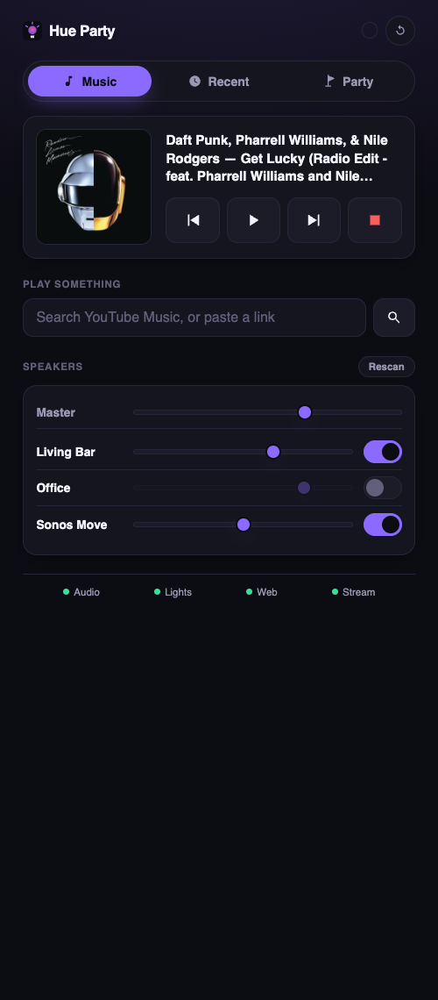
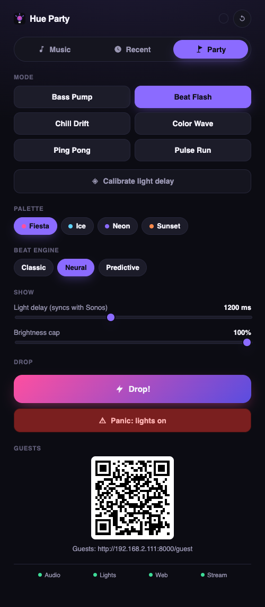

# Hue Party

[](https://github.com/arcodergh/hue-party/actions/workflows/ci.yml)
[](LICENSE)

<p align="center">
  
  &nbsp;
  
</p>

## What this is

A music-reactive Hue party server. Play music through YouTube Music in Chrome on a
Linux box; the audio is routed through PipeWire to both a local analyzer and — via
AirPlay — a Sonos speaker. The analyzer extracts beats, tempo, and frequency bands in
real time and drives Philips Hue lights over the Entertainment (DTLS) API, in sync
with the audio, with a tunable delay so the lights land on the same beat guests hear
out of the Sonos. A phone-friendly web UI lets the host pick effect modes and palettes,
trigger drop/panic effects, and control playback (via MPRIS/`playerctl`), while guests
on a second phone can vote on colors from their own page.

## Requirements

- Ubuntu (or another Linux distro) running PipeWire for audio. A minimal/server install
  is fine — everything below assumes you're starting from one.
- A Philips Hue bridge (v2 / square bridge) with an Entertainment Area configured for
  the lights you want to sync.
- A Sonos speaker that supports AirPlay 2, on the same LAN as this box.
- **Google Chrome.** Not preinstalled on Ubuntu — add Google's repo and install it:

  ```bash
  wget -qO- https://dl.google.com/linux/linux_signing_key.pub | sudo gpg --dearmor -o /usr/share/keyrings/google-chrome.gpg
  echo "deb [arch=amd64 signed-by=/usr/share/keyrings/google-chrome.gpg] http://dl.google.com/linux/chrome/deb/ stable main" | sudo tee /etc/apt/sources.list.d/google-chrome.list
  sudo apt update
  sudo apt install google-chrome-stable
  ```

- System packages: `playerctl` (MPRIS control of the Chrome/YouTube Music player),
  `avahi-daemon` (mDNS, required for AirPlay discovery), `pulseaudio-utils` (provides
  `pactl`, used by the setup script and the startup preflight check), and
  `libportaudio2` (the native audio library `sounddevice` needs — the analyzer fails
  to even import without it). `pavucontrol` is handy for routing Chrome's audio
  output by hand.

  ```bash
  sudo apt install playerctl avahi-daemon pulseaudio-utils libportaudio2 pavucontrol
  ```

  If your PipeWire install is minimal enough that AirPlay discovery
  (`scripts/setup-audio.sh`) can't find `module-raop-discover`, also install
  `libspa-0.2-modules` — it ships that module and is present by default on most
  desktop Ubuntu installs.

- [`uv`](https://docs.astral.sh/uv/) for running and managing the Python environment
  (`curl -LsSf https://astral.sh/uv/install.sh | sh` if you don't have it).

## Setup

1. Install the system packages above (Chrome, `playerctl`, etc.) first — `make install`
   only installs this project's *Python* dependencies via `uv`:

   ```bash
   make install
   ```

2. Edit `config/application.yaml`:
   - `hue.bridge_host` — your Hue bridge's IP address (Hue app: Settings → My Hue
     System → tap the bridge).
   - `hue.entertainment_area` — the **id** of the Entertainment Area to stream to
     (matched exactly, not by name). Leave empty to use the first area found on the
     bridge — the common case if you only have one. If you do set it and get it
     wrong, the startup error lists every available area's id so you can copy the
     right one.
   - `hue.white_light_ids` — (optional) `aiohue` v2 light resource ids for any white
     bulbs you want to use for ambient cues (e.g. slow swells on quiet
     stretches). Leave empty to skip white-bulb cues entirely.

3. Pair with the Hue bridge. Press the physical link button on the bridge first, then:

   ```bash
   uv run hue-party pair
   ```

   This writes `HUE_APP_KEY` and `HUE_CLIENT_KEY` into `.env` (see `.env.example` for
   the expected format). Keep `.env` private — it is already gitignored.

4. Set up the audio plumbing (creates the `music_bus` virtual sink and the AirPlay
   loopback to Sonos):

   ```bash
   ./scripts/setup-audio.sh
   ```

   This is a one-time-per-boot step — see the comment at the top of the script for
   why, and "Sonos troubleshooting" below for a way to make it survive reboots.

5. Open Chrome, log into YouTube Music, and start playing something. Move Chrome's
   audio output to the `music_bus` sink — either via `pavucontrol` (Playback tab, per
   application) or your desktop's sound settings. PipeWire remembers this choice for
   Chrome on future launches.

## Running

Start the party server:

```bash
make run
```

This runs preflight checks (Hue credentials present, `music_bus` sink exists), then
starts the audio analyzer, the Hue light streamer, the MPRIS player poller, and the
web server together under a supervisor that restarts any of them if they crash.

A stream watchdog ties the light stream to playback. The Hue Entertainment stream is
one-way, so the server can't otherwise tell when the bridge stops honoring it — if
someone stops the sync from the Hue app (or another app takes the stream over) while
music is playing, the watchdog notices within a few seconds and reclaims it. When the
music has been stopped for a grace period (`hue.music_stop_grace_s`, default 15 s),
the stream is shut down so the lights return to normal — and the Hue app is free to
run its own sync until music starts again. `hue.watchdog_poll_s` (default 5 s) sets
how often it checks.

With `hue.blackout_others: true` (the default), the watchdog also runs a **party
blackout**: the moment music starts, every bridge light *outside* the entertainment
area — white-cue bulbs included — is snapshotted and turned off, and when the music
stops (or the server shuts down) the snapshot is restored. The snapshot is written to
`~/.config/hue-party/blackout.json` before any light is touched, so a crash mid-party
can't lose the pre-party state. White-bulb ambient cues are suppressed while the
blackout holds — except in panic mode, which always brings the white bulbs up.

### Beat engines

The Party tab has a **Beat engine** picker (also `audio.beat_engine` in the config)
for how beats are derived from the audio, switchable live for A/B testing:

- **classic** — reactive: fires when aubio or the bass-jump detector hears a beat.
- **predictive** — aubio estimates the BPM while a phase-locked grid *schedules*
  beats at that period, nudged toward real detections; detections wobble, the grid
  doesn't, so flashes feel locked to the groove. Goes quiet when the music does.
- **neural** — madmom's neural-network beat tracker; heavier, and only offered when
  the optional dependency is installed (`uv sync --extra neural`).

On startup it prints two URLs:

- **Host UI** — `http://<this-box>:8000/` — mode/palette selection, delay slider,
  brightness cap, panic button, and playback controls. All effect modes step with
  detected beats (color_wave chases light-to-light per beat; chill_drift crossfades
  at half/quarter-time; bass_pump slams on the beat from a near-dark floor;
  pulse_run hops a single pulse across the room). The **Drop!** button strobes for
  `show.drop_duration_s` (default 5 s) with a countdown bar. The Speakers card's
  **Rescan** button reloads AirPlay mDNS discovery when Sonos speakers go missing,
  and a background healer relinks flapped speakers automatically. Open this on your
  own phone.
- The host UI's **Recent** tab lists the last 10 YouTube tracks and last 10 lists
  played (persisted in `~/.config/hue-party/history.json`); tap an entry to replay
  it. Entries played from search carry full metadata; pasted links get a
  best-effort title lookup.
- **Guest UI** — `http://<this-box>:8000/guest` — a simple color-vote page. Share this
  URL (or a QR code to it) with guests so they can nudge the room's tint.

### Run as a service (recommended)

Install hue-party as a systemd **user** service so it starts with your session,
restarts on crash, and logs to journald:

```bash
make service-install
```

Then manage it with `systemctl --user {status,restart,stop} hue-party` and follow
logs with `journalctl --user -u hue-party -f`; `make service-uninstall` removes it.
To keep it running across reboots without anyone logged in, additionally run
`sudo loginctl enable-linger $USER` once.

**Why a user service and not Docker?** The app's "hardware access" is really access
to your *session's* daemons: PipeWire (audio capture + the AirPlay sinks), the D-Bus
session bus (MPRIS control of Chrome), and Chrome itself on a display. A container
would need host networking plus the PipeWire and D-Bus sockets mounted in — at which
point nothing meaningful is isolated (Chrome, PipeWire, and the AirPlay modules all
still run on the host) while every one of those mounts is a thing that can silently
break. A systemd user unit gives the properties people actually want from
"packaged as a service" — supervised startup, crash restart, unified logging,
clean uninstall — with zero socket plumbing. One coupling to know about: album art
is read from Chrome's temp files under `/tmp`, so don't add `PrivateTmp=yes` to the
unit if you harden it further.

For development without real hardware — no Hue bridge, no Sonos, no PipeWire sink
required — render the light output as colored blocks in the terminal instead:

```bash
uv run hue-party run --simulate
```

`--simulate` skips preflight and the Hue Entertainment connection entirely.

## Calibrating the light delay

The Sonos → AirPlay path adds latency that the direct-to-analyzer path doesn't have,
so the lights will fire ahead of the audible beat unless you compensate:

1. On the host UI's Party tab, tap **Calibrate light delay** (the full-width button
   under the mode picker). Music pauses and a metronome starts: a click through the
   speakers and a flash on the lights, once per second. No beat detection is
   involved — the server first measures the active beat engine's detection latency
   on this machine (a ~1s benchmark, re-run at every calibration so the numbers are
   valid on whatever box the app runs on) and schedules each flash at
   `click + engine latency`, so the offset you land on is exactly right for the
   engine you had selected.
2. Drag the delay slider (0–3000 ms) until flash and click coincide.
3. Tap the button again to finish — the metronome stops, your previous mode comes
   back, and the music resumes.

Typical AirPlay-to-Sonos latency is in the 500 ms–1.5 s range depending on the
speaker and network; `config/application.yaml`'s `show.default_offset_ms` sets the
starting point for new sessions (default `1000`).

## Sonos troubleshooting

If the RAOP (AirPlay) sink drops audio or stutters, the most common fix is increasing
the AirPlay latency PipeWire negotiates with Sonos. `setup-audio.sh` loads
`module-raop-discover` with defaults; for a persistent, higher-latency configuration
that survives reboots, add a PipeWire config drop-in:

```
# /etc/pipewire/pipewire.conf.d/raop-discover.conf
context.modules = [
    {   name = libpipewire-module-raop-discover
        args = {
            raop.latency.ms = 1000
            raop.encryption.type = "auth_setup"
        }
    }
]
```

Reload PipeWire (`systemctl --user restart pipewire pipewire-pulse`) after adding
this, and re-run `./scripts/setup-audio.sh` to relink the loopback.

Other things to check if Sonos won't stay connected:

- The Sonos speaker and this box must be on the same LAN/VLAN — AirPlay discovery
  relies on mDNS, which most routers don't route across subnets.
- Open UDP port **5353** (mDNS discovery) and UDP ports **6001–6002** (RTP audio
  stream) on any host or network firewall between this box and the Sonos.
- `avahi-daemon` must be running (`systemctl status avahi-daemon`); `setup-audio.sh`
  warns if it isn't.

A more robust alternative — streaming directly to Sonos over HTTP with
[SoCo](https://github.com/SoCo/SoCo) instead of going through AirPlay — would avoid
the mDNS/mixed-latency issues entirely, but is out of scope here and noted as future
work.

## If AirPlay won't cooperate

If Sonos/AirPlay is unreliable on the night of the party and you don't have time to
debug it, fall back to local speakers:

1. Plug speakers directly into this box's audio output.
2. `setup-audio.sh` targets the RAOP (Sonos) sink, so it won't help here — instead,
   load a loopback straight to the local sink:

   ```bash
   pactl load-module module-loopback source=music_bus.monitor sink=@DEFAULT_SINK@ latency_msec=20
   ```

3. Set the delay slider near **0 ms** — a direct local output has negligible latency
   compared to AirPlay, so the lights need little or no compensation.

## HTTP API

The web server also exposes a small REST + WebSocket API, intended as the hook for a
future Home Assistant integration: `GET /api/state`, `POST /api/mode`,
`POST /api/palette`, `POST /api/offset`, `POST /api/brightness`, `POST /api/panic`,
`POST /api/drop/press`, `POST /api/drop/release`, `POST /api/guest/vote`,
`POST /api/player/{play_pause,next,previous}`, and `WS /ws` for live state pushes.

## License

[MIT](LICENSE)
